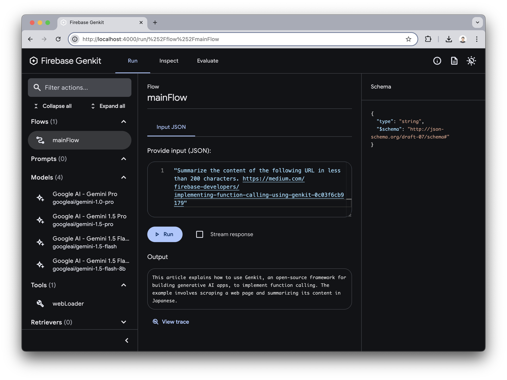
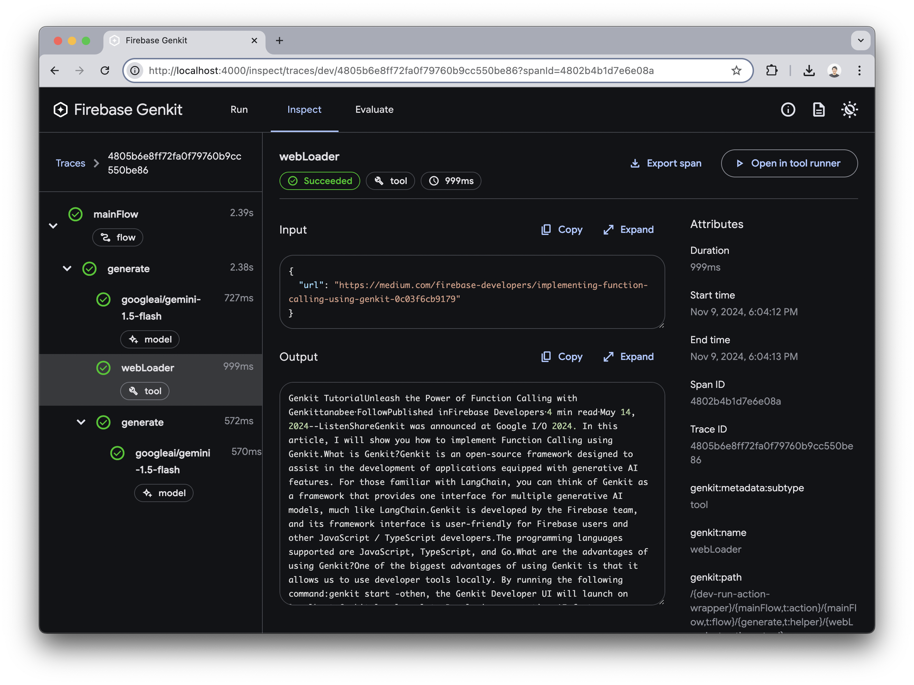

authors: Yuki Tanabe
summary: Genkit Hands-on
id: en
categories: genkit,firebase,javascript
environments: Web
status: Published
url: https://tanabee.github.io/genkit-codelab/en/
analytics_ga4_account: 2P6VCDLG05
feedback_link: https://github.com/tanabee/genkit-codelab/issues

# Genkit Hands-on

## Intro
Duration: 0:01:00

In this codelab, you’ll start with the initial setup of Genkit, then operate features like Code Execution and Function Calling in a local environment. Although it’s very straightforward, this codelab experience will show you how efficiently you can develop using Genkit.

### Prerequisites

- Node.js v20+
- npm

## Get Gemini API key
Duration: 0:02:00

Please access the following site to get the Gemini API key.

* [Get API key | Gemini](https://aistudio.google.com/app/apikey)

As of November 2024, the free plan of the Gemini API is sufficient for this hands-on session, so there’s no need for a paid plan.

* [Pricing models | Gemini](https://ai.google.dev/pricing)

Run the following curl command in your terminal, replacing `YOUR_API_KEY` with your actual key, and confirm that a response is successfully returned.

```sh
curl \
  -H 'Content-Type: application/json' \
  -d '{"contents":[{"parts":[{"text":"Explain Firebase in under 100 words."}]}]}' \
  -X POST 'https://generativelanguage.googleapis.com/v1beta/models/gemini-1.5-flash-latest:generateContent?key=YOUR_API_KEY'
```

If you're using Windows, please confirm with the following command on PowerShell.
```PowerShell
curl `
  -H "Content-Type: application/json" `
  -d '{"contents":[{"parts":[{"text":"Explain Firebase in under 100 words."}]}]}' `
  -X POST 'https://generativelanguage.googleapis.com/v1beta/models/gemini-1.5-flash-latest:generateContent?key=YOUR_API_KEY'
```

## Hello Genkit!
Duration: 0:05:00

In this section, we’ll run Genkit locally with its minimal configuration. Run the following commands to initialize the project.

```sh
mkdir hello-genkit && cd hello-genkit
npm init -y
npm i -D genkit-cli
npm i genkit @genkit-ai/googleai
mkdir src
```

Set the Gemini API key you obtained earlier as an environment variable.

```sh
export GOOGLE_GENAI_API_KEY=<your API key>
```

If you're using Windows, set the Gemini API key as an environment running the following command on PowerShell.
```PowerShell
$env:GOOGLE_GENAI_API_KEY=<your API key>
```

Please create `src/index.ts` file and paste the following code.

```javaScript
import { genkit, z } from 'genkit'
import { googleAI, gemini15Flash } from '@genkit-ai/googleai'
import { logger } from 'genkit/logging'
logger.setLogLevel('debug')

const ai = genkit({
  plugins: [googleAI()],
  model: gemini15Flash,
})

const mainFlow = ai.defineFlow({
  name: 'mainFlow',
  inputSchema: z.string(),
}, async (input) => {
  const { text } = await ai.generate(input)
  return text
})

ai.startFlowServer({ flows: [mainFlow] })
```

Genkit will start with the following command, and Developer Tools will automatically launch.

```sh
npx genkit start -o -- npx tsx --watch src/index.ts
```

In the Flows menu, select `mainFlow` defined in the code above. Enter a string and select the `Run` button to send a prompt to Gemini.

* Prompt: `Explain Firebase in under 100 words.`


Press the `View trace` button to see detailed Input and Output from the Gemini API.


## Code Execution
Duration: 0:03:00

With Gemini’s Code Execution, you can generate and execute Python code. Only one line needs to be changed.

```javascript
-  model: gemini15Flash,
+  model: gemini15Flash.withConfig({ codeExecution: true }),
```

Open Developer Tools, input prompts that require programming into mainFlow, and try the following requests:

* `Simulate the ratio of heads to tails after flipping a coin 100,000 times.`
* `Calculate the 100th Fibonacci number.`
* `Execute the following code in Python: print('Hello World')`

Here is the result.


In the View trace menu, you can see the Python code that was executed.


### Challenge
Try thinking up prompts that require Code Execution and give them a try.

## Function Calling
Duration: 0:05:00

Function Calling allows generative AI to call predefined functions as needed to fulfill user requests. Here are some possible use cases:

* Extracting content from URLs or PDFs included in user requests.
* Calling external APIs, such as:
  * Adding to a calendar
  * Sending notifications to a chat service
  * Searching internal documents
  * Google search

In this codelab, you’ll implement a tool to extract the contents of a URL and try calling it with Function Calling using [Cheerio](https://www.npmjs.com/package/cheerio) as the HTML parser.

```sh
npm i cheerio
```

Remove Code Execution for now.

```javascript
-  model: gemini15Flash.withConfig({ codeExecution: true }),
+  model: gemini15Flash,
```

Import cheerio.

```javascript
  import { genkit, z } from 'genkit'
  import { googleAI, gemini15Flash } from '@genkit-ai/googleai'
+ import * as cheerio from 'cheerio'
```

Add the following function under the definition of the `ai` variable in `src/index.ts`. The first argument specifies the tool’s configuration values, and the second argument specifies the process to execute.

```javascript
const webLoader = ai.defineTool(
  {
    name: "webLoader",
    description:
      "When a URL is received, it accesses the URL and retrieves the content inside.",
    inputSchema: z.object({ url: z.string() }),
    outputSchema: z.string(),
  },
  async ({ url }) => {
    const res = await fetch(url)
    const html = await res.text()
    const $ = cheerio.load(html)
    $("script, style, noscript").remove()
    if ($("article")) {
      return $("article").text()
    }
    return $("body").text()
  },
)
```

Specify `tools` in the `generate` method parameter and include `webLoader` in the array. Since `tools` can be specified as an array, you can set multiple tools, and generative AI will select the necessary tool for execution based on the `description` in `defineTool`. Just like prompt engineering, tuning description is essential.

```javascript
-  const { text } = await ai.generate(input)
+  const { text } = await ai.generate({ prompt: input, tools: [webLoader] })
```

The final source code can be found at the following GitHub URL.

[https://github.com/tanabee/genkit-codelab/blob/main/steps/function-calling/src/index.ts](https://github.com/tanabee/genkit-codelab/blob/main/steps/function-calling/src/index.ts)

Now that the code is complete, open Developer Tools. You’ll see that webLoader has been added to the Tools menu. Select webLoader, enter the following URL, and execute it.

URL: [https://medium.com/firebase-developers/implementing-function-calling-using-genkit-0c03f6cb9179](https://medium.com/firebase-developers/implementing-function-calling-using-genkit-0c03f6cb9179)


The content of the URL was extracted. In Genkit Developer Tools, you can test tools individually to verify their functionality before incorporating them into a Flow, making development more efficient.

Next, select mainFlow from the Flow menu. Enter the following prompt and execute it.

Prompt: `First, fetch the content inside URL. Next, summarize the content in less than 200 words. https://medium.com/firebase-developers/implementing-function-calling-using-genkit-0c03f6cb9179`

You can see that the content has been summarized based on the extracted content.



Look at the View trace. You’ll see that while two requests were made to the Gemini API, webLoader was called in between, confirming that the tool was indeed called.



### Challenge

Try defining your own tools and implementing Function Calling.

## Congrats!
Duration: 0:01:00

This concludes the hands-on session. It’s impressive that so much can be achieved with such little code. Here are some next steps for those who want to dive deeper.

### Next steps

- [High-Precision Responses with Genkit’s Google Search Integration](https://medium.com/firebase-developers/high-precision-responses-with-genkits-google-search-integration-7f142f5c9693)
- [Deploying Your Firebase Genkit Application with Firebase Functions](https://medium.com/@yukinagae/deploying-your-firebase-genkit-application-with-firebase-functions-99c7d0044964)
- [Official Codelab: RAG](https://firebase.google.com/codelabs/ai-genkit-rag)
- [Master Gemma2 and Genkit](https://medium.com/firebase-developers/how-to-develop-using-the-gemma2-model-in-genkit-085f22ce68f3)
- [Build a Slack Bot App with Firebase Genkit in just 100 Lines](https://medium.com/firebase-developers/build-a-slack-bot-app-with-firebase-genkit-in-just-100-lines-71d4e49c9e08)
- [Firebase Genkit for Go Developers: A Guide to Building LLM Applications](https://medium.com/@yukinagae/firebase-genkit-for-go-developers-a-guide-to-building-llm-applications-f96c51c34b10)