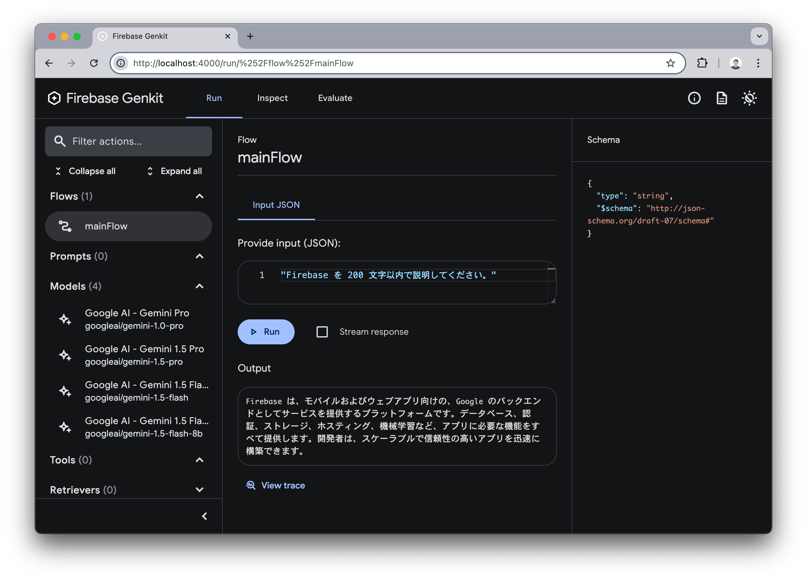
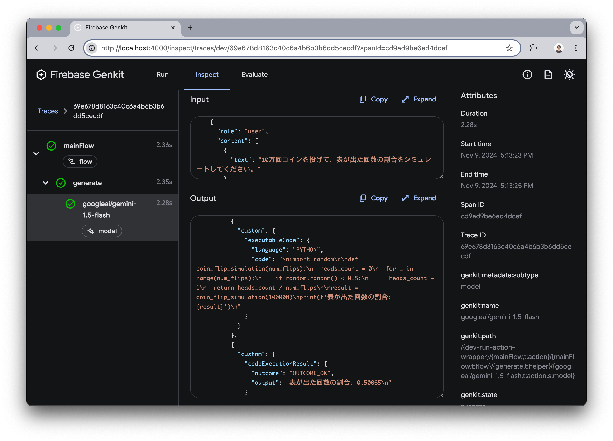
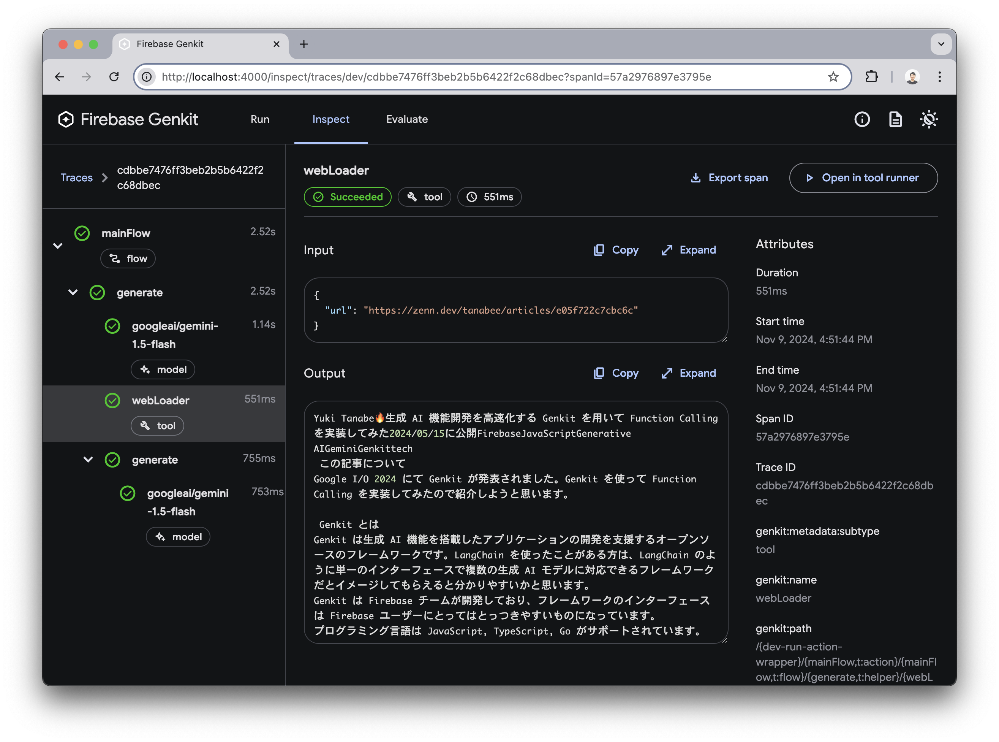

authors: Yuki Tanabe
summary: Genkit Hands-on
id: ja
categories: genkit,firebase,javascript
environments: Web
status: Published
url: https://tanabee.github.io/genkit-codelab/ja/
analytics_ga4_account: 2P6VCDLG05
feedback_link: https://github.com/tanabee/genkit-codelab/issues

# Genkit Hands-on

## Intro
Duration: 0:01:00

このハンズオンでは Genkit の初期セットアップからはじめて、 Code Execution や Function Calling などの機能をローカル環境で動作させます。非常に簡単な内容になっていますが、このハンズオンを通して Genkit を用いた開発がいかに効率的に行えるか体験していただけると思います。

### 前提条件

- Node.js v20+
- npm

## Get Gemini API key
Duration: 0:02:00

以下のサイトにアクセスし、 Gemini の API キーを取得してください。

* [Get API key | Gemini](https://aistudio.google.com/app/apikey)

2024 年 11 月現在では、 Gemini API の無料プランでもこのハンズオンを試すのに十分なので、有料プランでなくても問題ありません。

* [Pricing models | Gemini](https://ai.google.dev/pricing)

ターミナルで以下の curl コマンドを貼り付けて `YOUR_API_KEY` 部分を置き換えて実行してみます。正常にレスポンスが返ってくることを確認しましょう。

```sh
curl \
  -H 'Content-Type: application/json' \
  -d '{"contents":[{"parts":[{"text":"Explain Firebase in under 100 words."}]}]}' \
  -X POST 'https://generativelanguage.googleapis.com/v1beta/models/gemini-1.5-flash-latest:generateContent?key=YOUR_API_KEY'
```

## Hello Genkit!
Duration: 0:05:00

以下のコマンドを実行してプロジェクトの初期設定を行います。

```sh
mkdir hello-genkit && cd hello-genkit
npm init -y
npm i -D genkit-cli
npm i genkit @genkit-ai/googleai
mkdir src && touch src/index.ts
```

先ほど取得した Gemini の API キーを環境変数にセットします。

```sh
export GOOGLE_GENAI_API_KEY=<your API key>
```

`src/index.ts` ファイルを作成し、以下のコードを貼り付けます。

```JavaScript
import { genkit, z } from 'genkit'
import { googleAI, gemini15Flash } from '@genkit-ai/googleai'

const ai = genkit({
  plugins: [googleAI()],
  model: gemini15Flash,
})

const mainFlow = ai.defineFlow({
  name: 'mainFlow',
  inputSchema: z.string(),
}, async (input) => {
  const { text } = await ai.generate(input)
  return text
})

ai.startFlowServer({ flows: [mainFlow] })
```

以下のコマンドで Genkit が起動し、 Developer Tools が自動的に立ち上がります。

```sh
npx genkit start -o -- npx tsx --watch src/index.ts
```

Flows メニューに上記のコードで指定した `mainFlow` を選択します。文字列を入力し `Run` ボタンを選択すると Gemini に対してプロンプトを投げることができます。

* プロンプト例: `Firebase を 200 文字以内で説明してください。`



`View trace` ボタンを押すと Gemini API に対する Input, Output を詳細に確認することができます。


## Code Execution
Duration: 0:03:00

Gemini の Code Execution を用いると、 Python コードを生成・実行することが可能になります。コードの変更は 1 行だけです。

```javascript
-  model: gemini15Flash,
+  model: gemini15Flash.withConfig({ codeExecution: true }),
```

Developer Tools を開いて `mainFlow` にプログラミングを要するプロンプトを入力しましょう。以下にリクエスト例を挙げます。

* `10 万回コインを投げて、表が出た回数の割合をシミュレートしてください。`
* `フィボナッチ数列の 100 番目の数を計算してください。`
* `Python で以下のコードを実行してください: print('Hello World')`

結果は以下のようになりました。


View trace メニューを見ると実際に実行された Python コードを確認することができます。


### チャレンジ
余裕のある方は Code Execution が必要なプロンプトを考えて実際に試してみましょう。

## Function Calling
Duration: 0:05:00

Function Calling は生成 AI が事前に定義された関数を必要に応じて呼び出し、ユーザーの要求に合致する処理を実行します。例えば以下のようなユースケースがあります。

* ユーザーのリクエストに URL や PDF が含まれている場合、その中身を抽出する。
* 外部 API を呼び出し
  * カレンダー登録
  * チャットサービスへの通知
  * 社内ドキュメント検索
  * Google 検索

このハンズオンでは URL の中身を抽出するツールを実装して Function Calling を体験してもらいます。HTML parser として [Cheerio](https://www.npmjs.com/package/cheerio) を利用します。

```sh
npm i cheerio
```

Code Execution は一度削除しておきます。

```javascript
-  model: gemini15Flash.withConfig({ codeExecution: true }),
+  model: gemini15Flash,
```

cheerio を import します。

```javascript
  import { genkit, z } from 'genkit';
  import { googleAI, gemini15Flash } from '@genkit-ai/googleai'
+ import * as cheerio from 'cheerio'
```

src/index.ts の `ai` 変数定義の下に以下の関数を追加します。第一引数に tool の設定値を指定し、第二引数に実行する処理を記載します。

```javascript
const webLoader = ai.defineTool(
  {
    name: "webLoader",
    description:
      "When a URL is received, it accesses the URL and retrieves the content inside.",
    inputSchema: z.object({ url: z.string() }),
    outputSchema: z.string(),
  },
  async ({ url }) => {
    const res = await fetch(url);
    const html = await res.text();
    const $ = cheerio.load(html);
    $("script, style, noscript").remove();
    if ($("article")) {
      return $("article").text();
    }
    return $("body").text();
  },
)
```

`generate` メソッドのパラメータに `tools` を指定して、配列の中身に `webLoader` を指定します。 `tools` は配列で指定できるので複数のツールを設定することができます。その中から必要なツールを生成 AI が選択して実行します。必要かどうかの判断は `defineTool` の `description` をもとに行われます。そのためプロンプトエンジニアリングと同様に `description` のチューニングは重要です。

```javascript
-  const { text } = await ai.generate(input)
+  const { text } = await ai.generate({ prompt: input, tools: [webLoader] })
```

全体のソースコードは以下になります。

```javascript
import { genkit, z } from 'genkit';
import { googleAI, gemini15Flash } from '@genkit-ai/googleai'
import * as cheerio from 'cheerio'

const ai = genkit({
  plugins: [googleAI()],
  model: gemini15Flash,
})

const webLoader = ai.defineTool(
  {
    name: "webLoader",
    description:
      "When a URL is received, it accesses the URL and retrieves the content inside.",
    inputSchema: z.object({ url: z.string() }),
    outputSchema: z.string(),
  },
  async ({ url }) => {
    const res = await fetch(url);
    const html = await res.text();
    const $ = cheerio.load(html);
    $("script, style, noscript").remove();
    if ($("article")) {
      return $("article").text();
    }
    return $("body").text();
  },
)

const mainFlow = ai.defineFlow({
  name: 'mainFlow',
  inputSchema: z.string(),
}, async (input) => {
  const { text } = await ai.generate({
    prompt: input,
    tools: [webLoader],
  })
  return text
})

ai.startFlowServer({ flows: [mainFlow] })
```

それでは、コードが完成したので Developer Tools を開いてみます。 Tools メニューに webLoader が追加されていることが分かります。 webLoader を選択し、以下の URL を挿入して実行します。

URL: [https://zenn.dev/tanabee/articles/e05f722c7cbc6c](https://zenn.dev/tanabee/articles/e05f722c7cbc6c)


URL の中身のコンテンツを抽出できました。このように Genkit の Deleloper Tools では tool 単体で検証することができます。tool が実際に動作することが分かって Flow に組み込むことができるので効率よく開発を進められます。

次に Flow メニューから mainFlow を選択します。以下のようにプロンプトを入力して実行してみます。

プロンプト: `以下の URL の内容を 200 文字以内で要約してください。https://zenn.dev/tanabee/articles/e05f722c7cbc6c`

抽出された内容をもとに要約されていることが分かります。


View trace を見てみます。すると Gemini API リクエストが 2 回行われている間に webLoader の呼び出しがあり、実際に tool が呼び出されたことが分かります。



### チャレンジ
余裕のある方は自分で tool を定義して Function Calling を実装してみましょう。

## Congrats!
Duration: 0:01:00

以上でこのハンズオンは終わりです。少量のコードでこれだけのことが実現できるのは素晴らしいことだと思います。もっと深堀りしたい方向けに Next Action を提示しておきます。

### Next steps

- [Google Search を用いた Grounding](https://medium.com/firebase-developers/high-precision-responses-with-genkits-google-search-integration-7f142f5c9693)
- [Firebase Genkit アプリを Functions へ手軽にデプロイする](https://zenn.dev/cureapp/articles/e8f0dd47641bfd)
- [公式 Codelab: RAG](https://firebase.google.com/codelabs/ai-genkit-rag)
- [Genkit を使って Gemma2 をローカル LLM として呼び出す](https://zenn.dev/cureapp/articles/76bf38216ca304)
- [100 行で作る Firebase Genkit の Slack ボットアプリ](https://zenn.dev/cureapp/articles/1abb1ad278bb0b)
- [Goエンジニアのための生成AI - Firebase Genkit入門](https://zenn.dev/yukinagae/articles/4edbd93a675077)